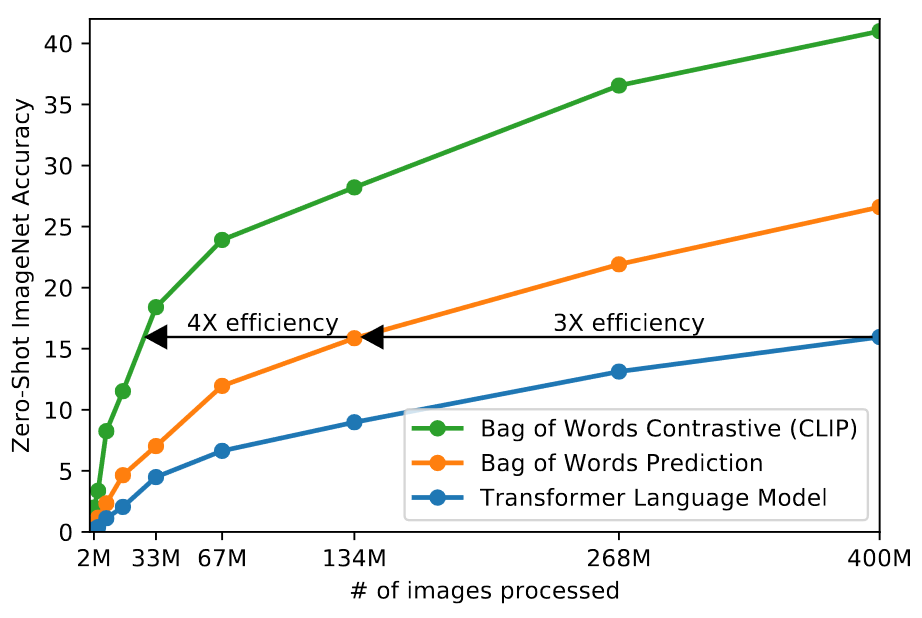
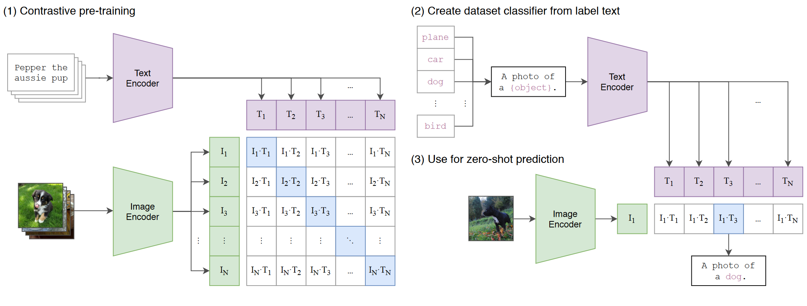

### CLIP

[paper link](https://arxiv.org/pdf/2103.00020)

> 용어
>
> > transfer: 사전 학습된 지식을 새로운 작업에 적용하는 것 
> > supervision (learning): 지도 (학습) 
> > pre-training: 모델이 특정한 작업에 초점을 맞추기 전에, 대규모의 일반적인 데이터셋을 사용하여 기본적인 패턴과 구조를 학습하는 -

0. Abstract

   > State-of-the-art computer vision systems are trained to predict a fixed set of predetermined object categories

   최첨단 컴퓨터 비전 시스템은 미리 정해진 고정된 집합의 카테고리를 예측.

   - 전통적인 컴퓨터 비전은 특정 작업을 위해 학습된 데이터셋을 사용. ex) 이미지 분류 모델은 고양이와 개를 구분하기 위해 고양이와 개 이미지를 포함한 데이터셋으로 학습함. 이러한 모델들은 고정된 카테고리를 사용하고 특정 데이터셋에 특화되어있음.

   - 미리 정해진 고정된 집합의 카테고리: [강아지, 고양이, 자동차 ...]

   - 특정 데이터셋에 특화: 데이터셋에 포함된 객체들만 인식 가능. 그 외 새로은 객체를 인식하기 위해서는 모델을 다시 학습해야 함.

   > this restrict form of supervision limits their generality and usability since additional labled data is needed to specify any other visual concept

   > 이러한 restrict form의 supervision은 limits한다. 그들의 generality와 usability를. since 추가적인 labeled data가 필요되어질 때. 어떠한 다른 visual concept를.

   이러한 제한된 형식의 supervision은 그들의 일반화와 사용성을 제한한다. 제한적인 레이블된 데이터는 어떠한 다른 시각적인 개념을 특정하는데 필요되어지기 때문에.

   - 즉, 기존 supervision learining의 한계를 말하고 있음.

   - 기존 지도 학습 방식에서는 모델이 특정 작업을 수행할 수 있도록 하기 위해서, 그 작업에 해당하는 레이블이 지정된 데이터셋을 사용하여 모델을 학습시는데, 위에서 말했다시피, 미리 정해진 고정된 집합의 카테고리 외의 새로운 카테고리를 추가하는 게 힘듦. 라벨링 다시 해야하고, 데이터셋도 필요하고 해서.. 물론 그 과정에서 엄청난 시간과 돈이 들어감.

   > learning directly from raw text about image는 a promising alternative which leverages a much broader source of supervision

   이미지와 함께 raw text를 바로 학습시키는 것은 supervision의 훨씬 더 넓은 source를 활용하는 것에 유망한 대체이다.

   즉, 이미지와 그 이미지에 대한 설명이 함께 제공되는 데이터셋을 사용하는 것은 훨씬 더 넓은 범위의 supervison을 활용하는 것에 대한 유망한 대안임을 주장.

   - 즉, 이미지에 라벨을 붙이고 학습시키는 것보다, 이미지와 이미지의 캡션 쌍을 함께 학습시키는 것이 훨씬 성능이 좋을 거다라고 말하는 건가

   - 기존에는 `{강아지: [강아지 이미지1, 강아지 이미지2 ... 강아지 이미지 n]}`으로 학습시켰다면, 이 논문에서는 `{강아지 이미지1: "들판을 뛰어다니는 강아지", 강아지 이미지2: "간식을 먹는 강아지" ... }`와 같이 나타낸다는 것.

   - 즉, 이미지와 함께 raw text를 바로 학습시키는 방식이 기존의 전통적인 supervision learning 방식에 비해 더 유망한 대안임을 나타냄. -> 텍스트 데이터를 통해 훨씬 더 넓은 범위의 visual concept 자체를 학습할 수 있음 -> 모델의 범용성 & 확장성?을 크게 향상시킬 수 있음.

   > we demonstrate that _the simple pre-training task of predicting which caption goes with which image_ is an efficient and scalable way to learn SOTA image representations from scratch on a dataset of 400 million (img-text) pairs collected from the internet.

   > 문장 왤케 길어

   > 우리는 (해당 논문에서) 시연한다. 간단한 pre-training task의 예측이, 어떠한 캡션이 어울리는지 with 어떠한 이미지가 효과적이고 확장 가능한 ,방식으로 SOTA 이미지 표현을, 학습하는 방법 / from scratch on 400 million의 이미지-텍스트 쌍이 모여진 데이터셋에서, 인터넷으로부터

   우리는 어떠한 이미지에 어떠한 캡션이 어울리는지 예측하는 간단한 pre-trained task가 SOTA 이미지 표현을 학습하는 효과적이고 확장 가능한 방법임을 시연한다. / from 인터넷에서 400 million의 이미지-텍스트 쌍이 collected된 데이터셋을 가져와서.

   - 대충 이 논문에서 `위에서 말한 거 테스트 해봐신디 생각보다 좋더라` 라는 것을 말하고 싶은 거 같음.

   > After pre-training, natural language is used to reference learned visual concepts (or describe new ones) enabling zero-shot transfer of the model to downstream tasks.

   > pre-training 이후, 자연어는 used된다. to reference learned visual concepts (or descrive new ones) enabling zero-shot transfer of the model to downstream tasts.

   pre-training 이후, 자연어는 학습된 visual concepts를 참조하거나, 새로운 것을 설명하는 것으로 모델을 하위 task로 zero-shot transfer가 가능하도록 사용된다.

   - `자연어가 학습된 시각적 개념을 참조하는 데 사용된다`가 뭘 뜻하는 거지... 여기서 말하는 `refernece`는 뭐 다른 뜻이 있는 건가..

   - 여튼, pre-training 해서 보니까 zero-shot transfer가 돼서 여러가지로 활용 가능하다고 말하는 거 같음.

   > We study the performance of this approach by benchmarking on over 30 different existing computer vision datasets, spanning tasks such as OCR, action recognition in videos, geo-localization, and many types of fine-grained object classification

   > 우리는 이 접근 performance를 연구했다. / 30개 이상의 다른, 존재하는 computer vision datasets를 벤치마킹해서. / ocr같은 spanning task나, 비디오 속 액션 인식이나, geo-localization이나, 많은 타입의 fine-grained object classification이나.

   우리는 30개 이상의 다른 computer vision datasets를 벤치마킹 해서 이러한 접근의 성능을 연구했다. / ocr같은 spanning task나, 비디오 속 액션 인식이나, geo-localization이나, 많은 타입의 fine-grained object classification이나...

   - SOTA 찍은 거 보면 평가도 잘 나왔겠죠 뭐.

   - 평가는 어련히 잘 하지 않았을까

   > The model transfers non-trivially to most tasks and is often competitive with a fully supervised baseline without the need for any dataset specific training.

   > 모델은 transfer한다. non trivially to most task가.. and model은 주로 competitive한다. with a fully supervised baseline without the need for any dataset specific training

   > 모델은 transfer한다. 사소하지 않은 주요 task에서. and 모델은 주로 완전한 supervised 기준으로 경쟁한다. 어떠한 dataset에 특정한 training이 필요하지 않도록.

   모델은 사소하지 않은 주요 task에서 transfer한다. 그리고, 모델은 주로 어떠한 데이터셋에 특정한 training이 필요하지 않도록 완전한 supervise 기준으로 경쟁한다.

   - 모델이 pre-trained만 했음에도, 즉, 특정 task에 대한 별도의 train이 없어도 supervised 모델과 경쟁할만한 성능을 보임.

   - 3줄요약

     - 우리 모델 zero-shot 쩔어요.
     - 우리 모델 pre-training만 해도 성능 잘나와요.
     - 우리 모델 어따가 붙이든 잘 작동해요.

   > training과 learning 차이? 
   > train: 모델 파라미터 최적화 
   > learn: "먼저, 학습은 지도 학습, 비지도 학습, 강화 학습과 같이 모델이 데이터나 경험을 통해 지식이나 스킬을 획득하는 과정입니다." ... "다시말해 학습의 일부로서 훈련이 이루어지며, 훈련을 통해 모델이 데이터에 대한 의미 있는 패턴을 학습하는 것입니다." [referenced here](https://byunghyun23.tistory.com/152)  
   > 설명이 굉장히 추상적이라부난 뭔가 더 이상해져신디..

   > For instance, we match the accuracy of the original ResNet-50 on ImageNet zero-shot without needing to use any of the 1.28 million training examples it was trained on.

   > 예를들어, 우리는 ~~~의 정확성을 match한다. without needing to use any of ~~training examples. it was trained on.

   예를들어, 우리는 ImageNet zero-shot에 원래 ResNet-50의 accuracy를 match한다. / 1.28 million의 training examples를 사용하지 않고도

   - 한줄요약
     - 우리 모델 짱짱좋음

     

   뭐야 abstract 하는데만 1시간 넘게 걸리네... 모델 어케 굴러가는지 나오면 한 페이지 하는데 한나절은 걸릴듯....😢

   논문 리뷰 생각보다 많이많이 힘들구나

---

1.  Introduction and Motivating Work

    - pre-training methods(raw text를 직접 사용하여 모델을 학습)들이 NLP 분야에서 중요한 변화를 이끌어냄. 위에서 말한 pre-training의 장점 다시 강조. 아래에 gpt3가 엥간한 supervised 모델들이랑 경쟁 가능한다고 하면서 이를 계속 강조함.

    - autoregressive와 같은 Task-agnostic objectives(비종속 작업 목표?)는 모델 용량, 필요 컴퓨팅 자원 등을 늘리면서 성능을 향상.

      > task-agnostic objectives: 특정 task에 한정되지 않는 모델 
      > autoregressive: 자기 회귀 모델링

    - text2text는 입출력 인터페이스?를 텍스트로 standardized함. -> task-agnostic objectives가 downstream dataset으로 zero-shot transfer 할 수 있도록 함.

      > input-output interface: ? 
      > downstream dataset: fine tuning을 위한 dataset.  downstream == fine tuning으로 봐도 무방할듯.

    - nlp쪽에선 dataset을 만들 때에는 기존 high-quality의 crowed-datasets보다 web-scale collections을 사용한 pre-training이 더 좋았다고 함. -> nlp처럼 컴퓨터 비전도 기존 crowd labeled dataset 사용하지 말고, 웹에서 싹 긁어오는 건 어떻냐고 제안.

    1.  `The olfactory bulb: coding and processing of odor molecule information` Mori et al. (1999)

        > Over 20 years ago Mori et al. (1999) explored improving content based image retrieval by training a model to predict the nouns and adjectives in text documents paired with images.

        - text document와 image를 pair 해서 데이터로 사용 -> 모델이 명사랑 형용사 예측하도록 학습시키는 방법으로 content based imgae retrieval을 improving 하려 함.

          > Content-Based Image Retrieval (CBIR): db에 이미지들의 feature vector들을 저장, 새로운 이미지의 feature vector를 뽑고, 유사도 가장 높은 이미지를 반환하는 친구 
          > Retrieval: 특정 기준에 맞는 이미지를 검색하고 가져오는 과정 전체?

         

    2.  `Multi-attention Recurrent Network for Human Communication Comprehension` Quattoni et al., 2007

        > Quattoni et al. (2007) demonstrated it was possible to learn more data efficient image representations via manifold learning in the weight space of classifiers trained to predict words in captions associated with images.

         

    3.  `Multimodal Learning with Deep Boltzmann Machines` Srivastava & Salakhutdinov, 2012

        > Srivastava & Salakhutdinov (2012) explored deep representation learning by training multimodal Deep Boltzmann Machines on top of low-level image and text tag features.

         

    4.  `Bag of Tricks for Efficient Text Classification` Joulin et al., 2016

        > Joulin et al. (2016) modernized this line of work and demonstrated that CNNs trained to predict words in image captions learn useful image representations.

        - 연구 흐름을 현대화?해서 image cpations의 단어를 예측하게 train된 CNN이 유용한? 이미지 표현을 학습할 수 있음을 확인

          > modernized: ?  
          > useful: ?

    5.  6.  ...

    6.  CLIP

        - CLIP은 이런 연구 흐름?의 최신 결과로, 이미지-텍스트 흐름의 최신 결과물로, 이미지-텍스트 pair로 학습된 표현이 다양한 transfer learning task에서 상당한 성능이 나옴을 보임.

     

    > While exciting as proofs of concept, using natural language supervision for image representation learning is still rare. This is likely because demonstrated performance on common benchmarks is much lower than alternative approaches. For example, Li et al. (2017) reach only 11.5% accuracy on ImageNet in a zero-shot setting. This is well below the 88.4% accuracy of the current state of the art (Xie et al., 2020). It is even below the 50% accuracy of classic computer vision approaches (Deng et al., 2012). Instead, more narrowly scoped but well-targeted uses of weak supervision have improved performance. Mahajan et al. (2018) showed that predicting ImageNet-related hashtags on Instagram images is an effective pre-training task. When fine-tuned to ImageNet these pre-trained models increased accuracy by over 5% and improved the overall state of the art at the time. Kolesnikov et al. (2019) and Dosovitskiy et al. (2020) have also demonstrated large gains on a broader set of transfer benchmarks by pre-training models to predict the classes of the noisily labeled JFT-300M dataset.

    - natural language supervision으로 image representation learning을 하는 것 자체는 exciting as proofs of concept하는데, 실제로 벤치 돌려보면 alternative approaches보다 아쉬운 성능을 냄.

      > zero-shot ImageNet 정확도
      >
      > - 자연어 supervision Li et al. (2017): 11.5%
      > - 최신 연구 Xie et al. (2020): 88.4%
      > - 기존 연구 Deng et al. (2012): 50%

      > natural language supervision: 이미지-텍스트로 image classifier를 trian

    - 근데, weak supervision을 사용하니까 성능이 5% 이상 좋아짐. 여기서 말하는 weak supervision은 pre-trained model을 파인튜닝 하는 거 말하는듯

      > weak supervision: 좁은 범위의 명확한 목표 -

    - Kolesnikov et al. (2019)이랑 Dosovitskiy et al. (2020)에서 노이즈 가득가득한 라벨을 예측하도록 pre-training함. -> 벤치에서 상당히 잘 나옴.

    > This line of work represents the current pragmatic middle ground between learning from a limited amount of supervised “gold-labels” and learning from practically unlimited amounts of raw text. However, it is not without compromises. Both works carefully design, and in the process limit, their supervision to 1000 and 18291 classes respectively. Natural language is able to express, and therefore supervise, a much wider set of visual concepts through its generality. Both approaches also use static softmax classifiers to perform prediction and lack a mechanism for dynamic outputs. This severely curtails their flexibility and limits their “zero-shot” capabilities.

    - 위 2개 연구는 양이 limited된 gold-label이랑 unlimited된 raw text 사이에서의 중간 지점을 나타냄.

      > gold-label: 사람이 직접 라벨링한 라벨들...  조니골드 땡기네 18년 말고 리저브로.. 맛은 어신디 그 스모키한 팔레트가 땡김

    - 두 연구 다 supervision을 각각 1000개와 18291개의 클래스로 제한하도록 설계함.

      \+ 자연어는 더 일반적이라서 gold-label보다 더 넓은 범위의 시각적 개념을 표현 & supervise할 수 있음.

    - 둘 다 static softmax classifier를 사용해서 예측 -> dynamic-ouput이 부족..? -> flexibility랑 zero-shot의 한계

     

    > ㅇㅇㄹㅇㄹㅇㄹ

    - weak supervision: Mahajan et al. (2018), Kolesnikov et al. (2019)은 백만~십억 개의 이미지로 모델을 train하는데 accelerator years가 됨..?

      > accelerator years: accelerator로 수년을 돌려야 한다 이런 뜻인가

    - 자연어 supervision: VirTex, ICMLM, ConVIRT 등은 십만 개의 이미지를 train하는데 accelerator days가 됨.

    > In this work, we close this gap and study the behaviors of image classifiers trained with natural language supervision at large scale. Enabled by the large amounts of publicly available data of this form on the internet, we create a new dataset of 400 million (image, text) pairs and demonstrate that a simplified version of ConVIRT trained from scratch, which we call CLIP, for Contrastive Language-Image Pre-training, is an efficient method of learning from natural language supervision.

    - 이 work?에선 this gap?을 가깝게 하고, large scale의 natural language supervision으로 trained된 image classifier를 연구

      > 여기서 말하는 `this gap`이 train 데이터를 말하는 건가.. 
      > close this gap: weak supervision과의 scale 차이를 줄인다 -> 자연어 supervision의 train scale을 늘린다 이렇게 해석하면 될듯

    - 인터넷에서 400 million의 이미지-텍스트 데이터셋을 긁어옴

    - CLIP(Contrastive Language-Image Pre-training)(단순화된 ConVIRT)은 효율적인 learning method from natural language supervision

    > We study the scalability of CLIP by training a series of eight models spanning almost 2 orders of magnitude of compute and observe that transfer performance is a smoothly predictable function of compute

    - CLIP 모델의 scalability를 연구 -> 2배의 컴퓨팅 크기의 8가지 모델을 훈련해서 transfer performance가 smoothly predictable function?인지

      - transfer performance가 크기에 따라 부드럽게 예측 가능한 함수의 형태로 변함 -> 컴퓨팅 크기 증가에 따라 성능이 일정하게 증가

      - 자원을 많이 넣을수록 성능 증가

        > 뭐야 너무 당연한 이야기인데 당연하지 않듯이 말하니까 뭐지 싶었네

    > We find that CLIP, similar to the GPT family, learns to perform a wide set of tasks during pre-training including OCR, geo-localization, action recognition, and many others.

    - CLIP도 GPT처럼 pre-training을 통해 OCR, geo-localization 등등 다양한 거 할 수 있음.

    > We measure this by benchmarking the zero-shot transfer performance of CLIP on over 30 existing datasets and find it can be competitive with prior task-specific supervised models.

    - 30개가 넘는 기존 데이터셋을 사용하여 CLIP의 zero-shot transfer performance를 벤치마킹 -> competitive with prior task-specific supervised models

    > We also confirm these findings with linear-probe representation learning analysis and show that CLIP outperforms the best publicly available ImageNet model while also being more computationally efficient

    - linear-probe representation learning을 분석하니 ImageNet model 중 성능이 가장 좋았고, 효율도 괜찮았음.

      > linear-probe: 특정 모델이 학습한 representation을 평가하는 방법. 모델이 학습한 표현을 고정하고 그 위에 linear regression을 학습시켜서 평가

    > We additionally find that zero-shot CLIP models are much more robust than equivalent accuracy supervised ImageNet models which suggests that zero-shot evaluation of task-agnostic models is much more representative of a model’s capability. These results have significant policy and ethical implications, which we consider in Section 7.

    - zero-shot CLIP이 비슷한 정확도의 다른 supervised 모델보다 robust?함. -> zero-shot evaluation이 task-agnostic 모델의 능력을 더 잘 대표함. -> 특정 작업 뿐만이 아닌, 범용성 높음.

      > robustness: 모델이 다양한 조건에서 안정적으로 성능을 유지하는 능력. -> 데이터 변화 or 노이즈 등에 대해 얼마나 잘 유지하는지

      \+ section 7에서 정책, 윤리적인 시사점? 관련해서도 이야기 함

---

## 2. Approach

### 2.1. Natural Language Supervision

> At the core of our approach is the idea of learning perception from supervision contained in natural language

- key idea: 자연어에 포함된 supervision을 통해 perception을 learning하는 것.

> As
> discussed in the introduction, this is not at all a new idea, however terminology used to describe work in this space is varied, even seemingly contradictory, and stated motivations are diverse.
>
> Joulin et al. (2016), and Desai & Johnson (2020) all introduce methods which learn visual representations from text paired with images but describe their approaches as unsupervised, self-supervised, weakly supervised, and supervised respectively.

- 완전히 새 아이디어는 아님, 근데 제대로 정의되지 않은 부분이 많음 -> Joulin et al. (2016), and Desai & Johnson (2020)는 이미지와 pair된 텍스트로 표현함. but 얘네는 각각 approaches는 unspervised, self-supervised, weakly supervised, supervised로 접근했음

  - 근데 이게 왜..? 뭐가 문제야

> We emphasize that what is common across this line of work is not any of the details of the particular methods used but the appreciation of natural language as a training signal.
>
> All these approaches are learning from natural language supervision.

- 여튼 다양한 방식이 사용됐지만, 모두 `자연어를 training signal`로 인식. -> 자연어를 통해 모델을 훈련시키는 접근 방식이 주요 키포인트.

> Although early work wrestled with the complexity of natural language when using topic model and n-gram representations, improvements in deep contextual representation learning suggest we now have the tools to effectively leverage this abundant source of supervision (McCann et al., 2017).

뭐야왤케길어요영어공부열심히해놓을걸

- early work들은 자연어의 complexity로 어려움을 겪음 / topic model & n-gram representations을 사용할 때에..

  > early work: 초기 연구
  > topic model: 문서 내의 topic을 추출하는 기법 
  > n-gram: 연속된 n개의 단어를 묶어서 language model을 만다는 방법

- deep contextual representation learning에서의 발전 -> abundant source of supervision을 제대로 활용할 수 있는 도구가 생김.

  - lstn? transformer? 도구는 이런 애들 말하는 건가?
  - 아니면 bert나 gpt같은 모델들을 말하는 건가

  > natural language는 말 그대로 내포하는 데이터 자체가 풍부해서 제대로 써먹을 수만 있다면 training data로 유용하게 쓰일 수 있음 -> 이걸 제대로 할 수 있게되었다는 걸 말하는듯

> Learning from natural language has several potential strengths over other training methods. It’s much easier to scale natural language supervision compared to standard crowd-sourced labeling for image classification since it does not require annotations to be in a classic “machine learning compatible format” such as the canonical 1-of-N majority vote “gold label”. Instead, methods which work on natural language can learn passively from the supervision contained in the vast amount of text on the internet. Learning from natural language also has an important advantage over most unsupervised or self-supervised learning approaches in that it doesn’t “just” learn a representation but also connects that representation to language which enables flexible zero-shot transfer. In the following subsections, we detail the specific approach we settled on.

- 자연어로 학습하는 것 -> scability 뛰어남, 추가적인 labeling 필요 없음, 방대한 양의 텍스트 데이터 사용 가능 ...

  - clip은 이렇게 자연어-이미지 함께 학습해서 zero-shot 뛰어남...

  > 이걸 계속계속 강조하네

### 2.2. Creating a Sufficiently Large Dataset

1. 기존 데이터셋의 한계

   - MS-COCO, Visual Genome: high quality crowd-labeled, 10만 장의 이미지
     - 다른 computer vision systems은 인스타에서 가져온 3.5 billion 장의 이미지를 학습함 ->
   - YFCC100M: 100 million 장의 이미지를 가져서 그나마 대안이 될 수 있음 but quality가 varying하고, metadata가 sparse함.
     - 카메라 설정값, 의미 없는 제목 등을 거르니 15 million 장의 이미지만 남음.

2. natural language supervision를 사용하는 이유

   - 인터넷에는 large quantities of data가 있음. but 기존 dataset은 이를 잘 반영하지 못함.

   - 이를 극복하기 위해 400 million의 이미지-텍스트 쌍을 인터넷에서 구함. + 500,000의 쿼리도 포함.

   - class balance를 위해 쿼리당 최대 20,000의 이미지-텍스트 쌍을 포함.

   - dataset의 단어 수는 gpt2를 학습시킬 때 사용한 WebText dataset과 비슷.

   - We refer to this dataset as WIT for WebImageText.

### 2.3. Selecting an Efficient Pre-Training Method

open set of visual concepts

- 최신 컴퓨터 비전 시스템의 계산 자원:
  ResNeXt101-32x48d를 train하는데 19 GPU years 사용, Noisy Student EfficientNet-L2를 훈련시키는데 33 TPUv3 core-years 사용.. -> 대충 최근 나오는 컴퓨터 비전 시스템 훈련시키는데 굉장히 오래 걸림.

  - 얘네들은 ImageNet dataset에 있는 1000개의 클래스만을 예측하기 위해서 훈련됨.

- 위 모델들은 1000개의 클래스만을 예측하도록 훈련됨.

- clip은 자연어로 open set of visual concepts 학습하는 것이 어렵긴 한데 어찌저찌해서 방법 찾아냄.

  - natural language supervision을 successfully scaling하기 위해서는 training efficiency가 key라는 것을 찾음.

- 초기엔 VirTex랑 비슷하게 image CNN - text transformer으로 이미지 caption을 예측하도록 함. but 이 방법은 efficiently scaling하는데 어려움이 발생.

  > difficulties efficiently scaling: 더 많은 데이터나 더 큰 모델을 사용해도 성능 향상이 더딘 -

  

  - 63 million 파라미터를 가진 transformer language model이 ResNet-50 image encoder보다 compute를 배로 하지만, ImageNet 클래스를 recognize하는데 3배가 느림.

  -> 복잡한 transformer language model을 사용하는 것이 오히려 비효율적일 수 있음 + 단순한 모델이 더 빠르고, 가벼운데 성능은 비슷.

  - cuz 이런 방법들은 try to predict the exact words of the text accompanying each image하려 하기 때문. 이미지와 co-occur하는 descriptions, comments, and related text는 다양해서, 정확한 단어를 예측하는 것은 어려움.

    -> 그래서 Contrastive Learning 사용.

  - 최근 연구에서, 이미지에 대한 contrastive representation learning이 contrastive objectives보다 더 좋은 representation을 learn할 수 있다는 것을 보임. + generative models of images은 high quality image representation을 learn 할 수 있지만, they require over an order of magnitude more compute than contrastive models with the same performance.

    > contrastive model: 이미지-텍스트 pair를 학습 -> 유사성을 극대화하는 -

    -> 그래서 clip 모델 만든 친구들은 text의 exact words를 predict하는 대신, text 전체가 어떠한 이미지와 paired되었는지만 predict하도록 - / `explored training a system to solve the potentially easier proxy task` 함

    > 여기서 말하는 easier proxy task가 텍스트와 이미지의 쌍을 학습시키는 방식?

  - 암튼 contrastive model 사용해서 기본적인 Bag-of-Words encoding을 swapped 하고, & observed a further 4x efficiency improvement in the rate of zero-shot transfer to ImageNet.

  2. simplification part

     - N개의 이미지-텍스트 쌍의 batch
     - goal

       - batch 내에서 가능한 N \* N 개의 이미지-텍스트 조합 중, 실제로 일어난 N개의 쌍을 예측.
       - image encoder와 text encoder를 사용해서 batch에서 N개의 실제 pair된 image embeding과 text embeding의 (N개) cosine simmilarity는 maximizing, 그 외에 embeding들(N^2 - N개)에서는 minimizing이 되도록.
       - symmetric cross entropy loss로 similarity scores를 최적화.

     - 데이터 양이 워낙 많아서 over fitting문제는 없음.

     - ImageNet weights나 pre-trained weights로 initializing 하는 것 없이 train -> 완전 zero-shot에 특화된 -

     - do not use the non-linear projection between the representation and the contrastive embedding space -> linear projection만을 사용해서 각각의 encoder의 representation을 multi-modal embedding space으로 mapping.

       > representation: encoder가 input data를 처리해서 생성하는 high-demention vector
       >
       > projection: input data를 lowe-dimension vector로 변환 -> 특징만 뽑아냄. cnn의 feature vector처럼 이해하면 될듯.
       >
       > contrastive embedding space: contrastive learning의 embedding vector. 비슷한 데이터는 가까운 vector로 표현하는
       >
       > multi-modal embedding space: 서로 다른 유형의 데이터를 같은 공간으로 mapping
       >
       > mapping: 한 집합의 요소를 다른 집합의 요소로 변환

       > We did not notice a difference in training efficiency between the two versions and speculate that non-linear projections may be co-adapted with details of current image only in self-supervised representation learning methods.
       >
       > - linear와 non-linear 사이에 training efficiency 차이는 어신디, non-linear projection은 self-supervised representation learning methods에서만 current image의 details와 co-adapted될 수 있을 것 같다... 는 뭔 말이지

     - clip의 pre-train dataset(img-txt pair)의 대부분의 sentence가 single sentence이기에 Zhang et al. (2020)에서 사용된 text transformation function을 제거.

       > text transformation function: samples a single sentence at uniform from the text
       >
       > 얘를 지우는 게 뭔 의미가 있는 거지..? 이미 single sentence기에 굳이 이 func가 필요 없다는 건가

     - image transformation function를 단순화, A random square crop from resized images가 training 중에 사용된 유일한 data augmentation.

       > 안그래도 데이터 많은데 굳이 복잡하게 해서 일 생길 가능성을 만들지 않도록 하기 위해?

     - softmax에서 range of the logits를 controls하는 temperature parameter인 τ는 hyper-parameter로 turning하는 것을 avoid하기 위해 log-parameterized된 multiplicative scalar를 training 중에 optimized.

     -> dataset이 엥간히 큰 게 아니니까 over fitting 문제x -> 복잡한 기법들을 간소화

---

### 2.4. Choosing and Scaling a Model

- img encoder는 ResNet-50이랑 ViT를 consider함.

  - `ResNetD` and `antialiased rect-2 blur pooling`를 using해서 make several modifications to the original version함.

    > ResNetD: ResNet의 개선
    >
    > antialiased rect-2 blur pooling: img processing을 더 부드럽게 -> sampling 중 발생할 수 있는 왜곡을 줄임

  - replace the global average pooling layer with an attention pooling mechanism

    - attention pooling은 query가 the global average-pooled representation of the image에 따라 conditioned되는 “transformer-style”의 multi-head QKV attention의 single layer로 implemented 됨... ? 뭔소리야　이건

    > global average pooling layer: cnn에서 사용되는 pooling 기법, GAP layer는 input feature map의 각 채널별로 평균값을 계산해서 하나의 숫자로 압축
    >
    > attention pooling mechanism: attention을 사용해서 중요한 feature를 강조. input data의 특정 부분에 가중치를 줌.

  - transformer 앞에 결합된 combined patch와 position embeddings에 additional layer normalization을 하고, 기존 ViT와는 다른 initialization scheme을 사용.

    > 기존 방법들을 수정해서 성능 향상 & 최적화 진행

- text encoder는 attention all you need의 transformer를 기반으로 함.

  - Radford et al. (2019).이 described한 architecture modifications가 적용됨.

  - 63M-parameter 12-layer 512-wide model with 8 attention heads로 구성됨.

  - 텍스트는 Lower-cased로 변환, (BPE)로 49,152 vocab size로 토큰화됨.

    > BPE: 텍스트를 sub-word 단위로 분할해서 처리

  - For computational efficiency, the max sequence length was capped at 76

  - The text sequence는 [SOS] and [EOS] tokens로 묶임.

    - Transformer의 highest layer에서 [EOS] token 위치의 activations가 feature representation of the text 로 처리..?

    - 이러한 feature representation은 layer normalization 이후, multi-modal embedding space로 linearly projected됨.

  - text encoder에는 pre-trained된 language model로 initialize하거나 add language modeling as an auxiliary objective 기능을 유지하기 위해 masked self-attention 사용 + though exploration of this is left as future work.

    > masking: 각 token이 바로 앞 token만을 참고하도록 함.

- 기존 computer vision research에서는 종종 width (Mahajan et al., 2018) or depth (He et al., 2016a)를 개별적으로 증가시켜 모델을 scaled함. but ResNet image encoder에선 width, depth, and resolution 모두에 allocating additional compute하는 것이 only allocating it to only one dimension 하는 것보다 outperforms 하다는 Tan & Le (2019)의 approach를 따름.

- Tan & Le(2019)는 allocated to each dimension되는 ratio of compute를 EfficientNet architecture에 맞게 tune 함. clip 연구에선 width, depth, and resolution of model을 increasing하는데 additional compute를 equally하게 allocating하는 simple baseline을 사용함.

- For the text encoder,

---

- figure1.
  

  > While standard image models jointly train an image feature extractor and a linear classifier to predict some label, CLIP jointly trains an image encoder and a text encoder to predict the correct pairings of a batch of (image, text) training examples. At test time the learned text encoder synthesizes a zero-shot linear classifier by embedding the names or descriptions of the target dataset’s classes

  - standard image models는 image feature extractor와 linear classifier를 함께 학습시켜 몇몇 라벨을 예측.

  - CLIP은 image encoder와 text encoder를 함께 학습시켜 이미지-텍스트 pair의 training examples batch의 정확한 pairing을 예측.

  -> 테스트 시 학습된 test encoder가 대상 dataset의 class name이나 description을 포함시켜서 zero-shot linear classifier를 합성?
